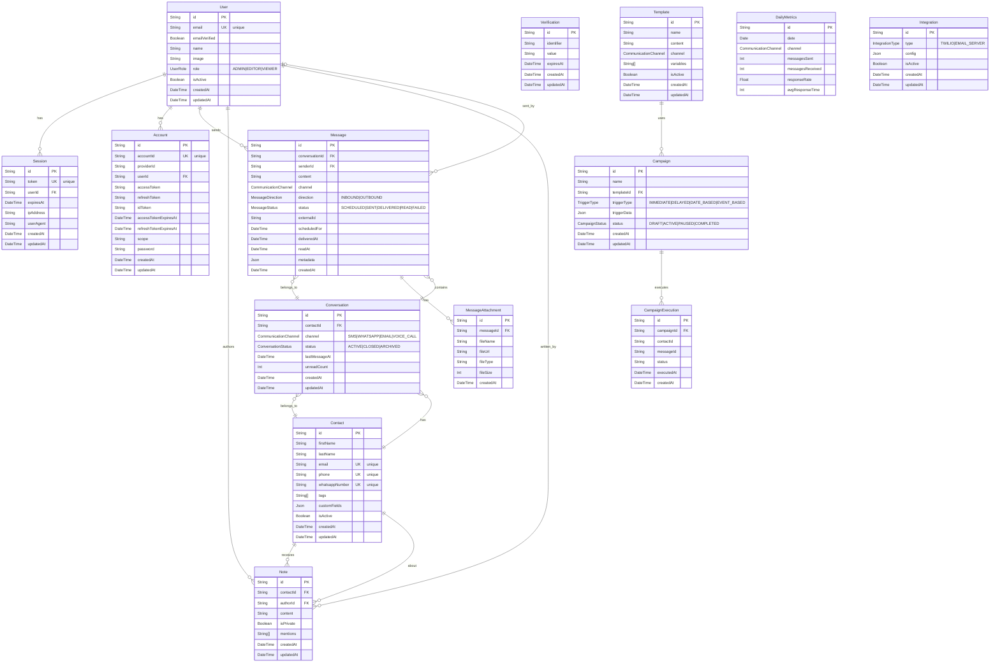

# UniBox - Unified Multi-Channel Communication Platform

UniBox is a comprehensive customer engagement platform that centralizes communication across SMS, WhatsApp, Email, and other channels into a single unified inbox. Built with Next.js 14+, TypeScript, and Prisma ORM.

## 🎥 Demo Video

[](https://www.loom.com/share/e983575143ab402b806a0c04adee81d9)

> **📹 See UniBox in Action**: Watch our comprehensive demo showcasing unified inbox management, multi-channel messaging (SMS, WhatsApp, Email), real-time conversations, contact management, team collaboration with @mentions, message scheduling, and analytics dashboard.

## 🚀 Features

### ✅ Core Functionality

- **Unified Inbox**: Kanban-style interface aggregating messages from all channels
- **Multi-Channel Messaging**: SMS, WhatsApp, Email with real-time delivery
- **Contact Management**: Centralized contact profiles with communication history
- **Message Scheduling**: Schedule messages across all channels with background processing
- **Team Collaboration**: Internal notes with @mentions, public/private visibility
- **File Attachments**: Support for email attachments (images, PDFs, documents)
- **Analytics Dashboard**: Response times, channel volume, engagement metrics
- **Real-time Updates**: Live message status and delivery confirmations

### 🔧 Technical Implementation

- **Authentication**: Better Auth with role-based access (Admin/Editor/Viewer)
- **Database**: PostgreSQL with Prisma ORM for type-safe queries
- **Integrations**: Twilio (SMS/WhatsApp), Custom Mail Server, extensible architecture
- **UI/UX**: Tailwind CSS, Radix UI components, responsive design
- **Background Jobs**: Scheduled message processing via API endpoints
- **File Storage**: Multipart form handling for attachments
- **Type Safety**: Full TypeScript coverage with Zod validation

## 📋 Quick Start

### Prerequisites

- Node.js 18+
- PostgreSQL database
- Twilio Account (for SMS/WhatsApp)
- Mail Server

### Installation

1. **Clone and Install**

   ```bash
   git clone https://github.com/your-org/unibox.git
   cd unibox
   npm install
   ```

2. **Environment Setup**

   ```bash
   cp .env.example .env
   # Configure your environment variables
   ```

3. **Database Setup**

   ```bash
   npx prisma generate
   npx prisma db push
   npx prisma db seed # Optional: seed with sample data
   ```

4. **Start Development**

   ```bash
   npm run dev
   ```

5. **Access Application**
   - Open http://localhost:3000
   - Sign up for a new account or use demo credentials

### Environment Variables

```env

# Connect to Supabase via connection pooling
DATABASE_URL=""

# Direct connection to the database. Used for migrations
DIRECT_URL=""

# Better Auth Configuration
BETTER_AUTH_SECRET="your-super-secure-secret-key-here-replace-in-production"
BETTER_AUTH_URL="http://localhost:3000"
NEXT_PUBLIC_BETTER_AUTH_URL="http://localhost:3000"

# Google OAuth (replace with your actual Google OAuth credentials)
GOOGLE_CLIENT_ID=""
GOOGLE_CLIENT_SECRET=""

# Twilio Configuration
TWILIO_ACCOUNT_SID=""
TWILIO_AUTH_TOKEN=""
TWILIO_PHONE_NUMBER=""
TWILIO_WHATSAPP_NUMBER="whatsapp:+14155238886"  # Twilio Sandbox number

# Custom Email Service Configuration
CUSTOM_EMAIL_API_KEY=""
CUSTOM_EMAIL_API_URL="https://mailer.adityacoomar.dev/api/send-mail"
CUSTOM_EMAIL_SENDER_NAME="UniBox Email Service"

# Scheduled Messages Cron Configuration
CRON_SECRET="unibox-cron-secret-2024"

# Application Configuration
NEXT_PUBLIC_APP_URL="http://localhost:3000"

```

## 📊 Integration Comparison Table

| Channel      | Latency | Cost         | Reliability | Character Limit | Media Support | Two-Way | API Quality |
| ------------ | ------- | ------------ | ----------- | --------------- | ------------- | ------- | ----------- |
| **SMS**      | ~1-3s   | $0.0075/msg  | 99.9%       | 160 chars       | ❌            | ✅      | ⭐⭐⭐⭐⭐  |
| **WhatsApp** | ~1-2s   | $0.005/msg   | 99.5%       | 4096 chars      | ✅            | ✅      | ⭐⭐⭐⭐⭐  |
| **Email**    | ~2-10s  | $0.001/email | 99.8%       | Unlimited       | ✅            | ✅      | ⭐⭐⭐⭐    |

### Integration Notes:

- **SMS**: Best for urgent notifications, high open rates (98%), works on all phones
- **WhatsApp**: Excellent for rich media, popular globally, business-friendly
- **Email**: Cost-effective for detailed communications, supports formatting
- **Social Media**: Good for customer service, limited by platform policies

## 🏗 Architecture Overview

### Database Schema ER Diagram



### Key Schema Features

- **Authentication**: Better Auth compatible with User, Session, Account, and Verification models
- **Multi-Channel Support**: Unified conversation model supporting SMS, WhatsApp, Email, and Voice
- **Message Scheduling**: Built-in scheduling with status tracking and delivery confirmation
- **Team Collaboration**: Private/public notes with @mentions functionality
- **Campaign Management**: Template-based automated messaging with execution tracking
- **Analytics**: Daily metrics tracking for performance monitoring
- **File Attachments**: Support for message attachments with metadata
- **Flexible Configuration**: JSON fields for extensible metadata and integration settings

### API Architecture

```
/api/
├── auth/[...all]/          # Better Auth handlers
├── contacts/               # Contact CRUD operations
├── conversations/          # Conversation management
├── messages/
│   └── send/              # Multi-channel message sending
├── notes/                 # Team collaboration notes
├── scheduled-messages/
│   └── process/           # Background job processor
├── sync/
│   └── emails/           # Email sync (IMAP polling)
└── webhooks/
    ├── twilio/           # SMS/WhatsApp inbound
    └── email/            # Email webhooks
```

### Component Structure

```
src/components/
├── ui/                   # Reusable UI components
├── dashboard/            # Main inbox interface
├── messaging/            # Message composition & sending
├── contacts/             # Contact management & notes
└── analytics/            # Dashboard & reporting
```

## 🔑 Key Architecture Decisions

### 1. **Database Design**

- **Normalized Schema**: Separate tables for contacts, conversations, messages
- **Flexible Metadata**: JSON fields for channel-specific data
- **Audit Trail**: CreatedAt/UpdatedAt on all entities
- **Soft Deletes**: Retain message history for compliance

### 2. **Message Scheduling**

- **Database-Only**: Simple PostgreSQL-based scheduling (no Redis/Queue needed)
- **API Endpoint**: `/api/scheduled-messages/process` for cron job execution
- **Idempotent**: Safe to run multiple times, handles failures gracefully
- **Scalable**: Batch processing (50 messages per run) for performance

### 3. **File Attachment Strategy**

- **Form Handling**: Multipart form data for email attachments
- **Size Limits**: 5MB per attachment, configurable
- **Security**: File type validation, virus scanning ready
- **Storage**: Local filesystem (easily extensible to S3/CloudFlare)

### 4. **Team Collaboration**

- **Note Privacy**: Public team notes vs private personal notes
- **@Mentions**: Real-time parsing and user lookup
- **Permissions**: Role-based access (Admin sees all, others see public + own)
- **Audit Trail**: Full editing history with timestamps

### 5. **Integration Orchestration**

- **Factory Pattern**: `createSender(channel)` for consistent API
- **Error Handling**: Graceful degradation, retry logic
- **Webhook Security**: HMAC signature verification
- **Rate Limiting**: Respect API limits, implement backoff

### 6. **Performance Optimizations**

- **React Query**: Optimistic updates, background refresh
- **Database Indexing**: Composite indexes on frequently queried fields
- **Pagination**: Cursor-based for conversations, offset for contacts
- **Lazy Loading**: Tab-based loading in contact details

## 🔧 Scheduled Message Processing

### Setup Cron Job

For production deployment, set up a cron job to process scheduled messages:

```bash
# Add to crontab (runs every minute)
* * * * * curl -H "Authorization: Bearer YOUR_CRON_SECRET" -X POST https://yourdomain.com/api/scheduled-messages/process
```

### Monitoring

Check processor status:

```bash
curl https://yourdomain.com/api/scheduled-messages/process
```

Response includes:

- Pending message count
- Future scheduled messages
- Recent processing history
- System health status

## 🤝 Contributing

1. Fork the repository
2. Create feature branch (`git checkout -b feature/amazing-feature`)
3. Commit changes (`git commit -m 'Add amazing feature'`)
4. Push branch (`git push origin feature/amazing-feature`)
5. Open Pull Request

### Development Guidelines

- Follow TypeScript strict mode
- Use Prisma for all database operations
- Implement proper error handling
- Add JSDoc comments for complex functions
- Test API endpoints with sample data

## 📝 License

This project is licensed under the MIT License - see the [LICENSE](LICENSE) file for details.

## 🙏 Acknowledgments

- **Twilio**: Reliable SMS/WhatsApp infrastructure
- **Resend**: Modern email delivery platform
- **Radix UI**: Accessible component primitives
- **Prisma**: Type-safe database toolkit
- **Next.js**: Full-stack React framework

---

**Built with ❤️ for modern customer engagement**

For questions or support, please open an issue or contact the maintainers.
